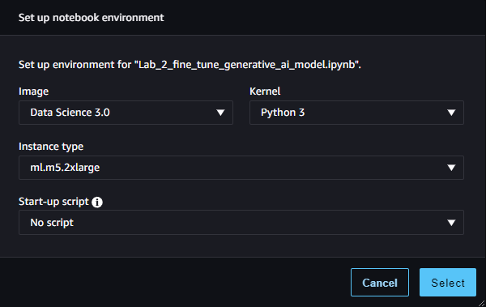

# Fine-Tune a Generative AI Model for Dialogue Summarization

In this notebook, you will fine-tune an existing LLM from Hugging Face for enhanced dialogue summarization. You will use the [FLAN-T5](https://huggingface.co/docs/transformers/model_doc/flan-t5) model, which provides a high quality instruction tuned model and can summarize text out of the box. To improve the inferences, you will explore a full fine-tuning approach and evaluate the results with ROUGE metrics. Then you will perform Parameter Efficient Fine-Tuning (PEFT), evaluate the resulting model and see that the benefits of PEFT outweigh the slightly-lower performance metrics.

# Table of Contents

- [ 1 - Set up Kernel, Load Required Dependencies, Dataset and LLM](#1)
  - [ 1.1 - Set up Kernel and Required Dependencies](#1.1)
  - [ 1.2 - Load Dataset and LLM](#1.2)
  - [ 1.3 - Test the Model with Zero Shot Inferencing](#1.3)
- [ 2 - Perform Full Fine-Tuning](#2)
  - [ 2.1 - Preprocess the Dialog-Summary Dataset](#2.1)
  - [ 2.2 - Fine-Tune the Model with the Preprocessed Dataset](#2.2)
  - [ 2.3 - Evaluate the Model Qualitatively (Human Evaluation)](#2.3)
  - [ 2.4 - Evaluate the Model Quantitatively (with ROUGE Metric)](#2.4)
- [ 3 - Perform Parameter Efficient Fine-Tuning (PEFT)](#3)
  - [ 3.1 - Setup the PEFT/LoRA model for Fine-Tuning](#3.1)
  - [ 3.2 - Train PEFT Adapter](#3.2)
  - [ 3.3 - Evaluate the Model Qualitatively (Human Evaluation)](#3.3)
  - [ 3.4 - Evaluate the Model Quantitatively (with ROUGE Metric)](#3.4)

<a name='1'></a>
## 1 - Set up Kernel, Load Required Dependencies, Dataset and LLM

<a name='1.1'></a>
### 1.1 - Set up Kernel and Required Dependencies

To begin with, check that the kernel is selected correctly.


If you click on that (top right of the screen), you'll be able to see and check the details of the image, kernel, and instance type.




```python
import os

instance_type_expected = 'ml-m5-2xlarge'
instance_type_current = os.environ.get('HOSTNAME')

print(f'Expected instance type: instance-datascience-{instance_type_expected}')
print(f'Currently chosen instance type: {instance_type_current}')

assert instance_type_expected in instance_type_current, f'ERROR. You selected the {instance_type_current} instance type. Please select {instance_type_expected} instead as shown on the screenshot above'
print("Instance type has been chosen correctly.")
```

    Expected instance type: instance-datascience-ml-m5-2xlarge
    Currently chosen instance type: instance-datascience-ml-m5-2xlarge
    Instance type has been chosen correctly.


Now install the required packages for the LLM and datasets.


```python
%pip install -U datasets==2.17.0

%pip install --upgrade pip
%pip install --disable-pip-version-check \
    torch==1.13.1 \
    torchdata==0.5.1 --quiet

%pip install \
    transformers==4.27.2 \
    evaluate==0.4.0 \
    rouge_score==0.1.2 \
    loralib==0.1.1 \
    peft==0.3.0 --quiet
```

    Collecting datasets==2.17.0
      Downloading datasets-2.17.0-py3-none-any.whl.metadata (20 kB)
    Requirement already satisfied: filelock in /opt/conda/lib/python3.10/site-packages (from datasets==2.17.0) (3.13.4)
    Requirement already satisfied: numpy>=1.17 in /opt/conda/lib/python3.10/site-packages (from datasets==2.17.0) (1.26.4)
    Requirement already satisfied: pyarrow>=12.0.0 in /opt/conda/lib/python3.10/site-packages (from datasets==2.17.0) (15.0.2)
    Requirement already satisfied: pyarrow-hotfix in /opt/conda/lib/python3.10/site-packages (from datasets==2.17.0) (0.6)
    Requirement already satisfied: dill<0.3.9,>=0.3.0 in /opt/conda/lib/python3.10/site-packages (from datasets==2.17.0) (0.3.8)
    Requirement already satisfied: pandas in /opt/conda/lib/python3.10/site-packages (from datasets==2.17.0) (2.2.2)
    Requirement already satisfied: requests>=2.19.0 in /opt/conda/lib/python3.10/site-packages (from datasets==2.17.0) (2.31.0)
    Requirement already satisfied: tqdm>=4.62.1 in /opt/conda/lib/python3.10/site-packages (from datasets==2.17.0) (4.66.1)
    Collecting xxhash (from datasets==2.17.0)
      Downloading xxhash-3.5.0-cp310-cp310-manylinux_2_17_x86_64.manylinux2014_x86_64.whl.metadata (12 kB)
    Requirement already satisfied: multiprocess in /opt/conda/lib/python3.10/site-packages (from datasets==2.17.0) (0.70.16)
    Collecting fsspec<=2023.10.0,>=2023.1.0 (from fsspec[http]<=2023.10.0,>=2023.1.0->datasets==2.17.0)
      Downloading fsspec-2023.10.0-py3-none-any.whl.metadata (6.8 kB)
    Collecting aiohttp (from datasets==2.17.0)
      Downloading aiohttp-3.10.5-cp310-cp310-manylinux_2_17_x86_64.manylinux2014_x86_64.whl.metadata (7.5 kB)
    Collecting huggingface-hub>=0.19.4 (from datasets==2.17.0)
      Downloading huggingface_hub-0.24.6-py3-none-any.whl.metadata (13 kB)
    Requirement already satisfied: packaging in /opt/conda/lib/python3.10/site-packages (from datasets==2.17.0) (23.2)
    Requirement already satisfied: pyyaml>=5.1 in /opt/conda/lib/python3.10/site-packages (from datasets==2.17.0) (6.0.1)
    Collecting aiohappyeyeballs>=2.3.0 (from aiohttp->datasets==2.17.0)
      Downloading aiohappyeyeballs-2.4.0-py3-none-any.whl.metadata (5.9 kB)
    Collecting aiosignal>=1.1.2 (from aiohttp->datasets==2.17.0)
      Downloading aiosignal-1.3.1-py3-none-any.whl.metadata (4.0 kB)
    Requirement already satisfied: attrs>=17.3.0 in /opt/conda/lib/python3.10/site-packages (from aiohttp->datasets==2.17.0) (23.2.0)
    Collecting frozenlist>=1.1.1 (from aiohttp->datasets==2.17.0)
      Downloading frozenlist-1.4.1-cp310-cp310-manylinux_2_5_x86_64.manylinux1_x86_64.manylinux_2_17_x86_64.manylinux2014_x86_64.whl.metadata (12 kB)
    Collecting multidict<7.0,>=4.5 (from aiohttp->datasets==2.17.0)
      Downloading multidict-6.0.5-cp310-cp310-manylinux_2_17_x86_64.manylinux2014_x86_64.whl.metadata (4.2 kB)
    Collecting yarl<2.0,>=1.0 (from aiohttp->datasets==2.17.0)
      Downloading yarl-1.9.4-cp310-cp310-manylinux_2_17_x86_64.manylinux2014_x86_64.whl.metadata (31 kB)
    Collecting async-timeout<5.0,>=4.0 (from aiohttp->datasets==2.17.0)
      Downloading async_timeout-4.0.3-py3-none-any.whl.metadata (4.2 kB)
    Requirement already satisfied: typing-extensions>=3.7.4.3 in /opt/conda/lib/python3.10/site-packages (from huggingface-hub>=0.19.4->datasets==2.17.0) (4.11.0)
    Requirement already satisfied: charset-normalizer<4,>=2 in /opt/conda/lib/python3.10/site-packages (from requests>=2.19.0->datasets==2.17.0) (3.3.2)
    Requirement already satisfied: idna<4,>=2.5 in /opt/conda/lib/python3.10/site-packages (from requests>=2.19.0->datasets==2.17.0) (3.6)
    Requirement already satisfied: urllib3<3,>=1.21.1 in /opt/conda/lib/python3.10/site-packages (from requests>=2.19.0->datasets==2.17.0) (2.2.1)
    Requirement already satisfied: certifi>=2017.4.17 in /opt/conda/lib/python3.10/site-packages (from requests>=2.19.0->datasets==2.17.0) (2024.2.2)
    Requirement already satisfied: python-dateutil>=2.8.2 in /opt/conda/lib/python3.10/site-packages (from pandas->datasets==2.17.0) (2.9.0)
    Requirement already satisfied: pytz>=2020.1 in /opt/conda/lib/python3.10/site-packages (from pandas->datasets==2.17.0) (2024.1)
    Requirement already satisfied: tzdata>=2022.7 in /opt/conda/lib/python3.10/site-packages (from pandas->datasets==2.17.0) (2024.1)
    Requirement already satisfied: six>=1.5 in /opt/conda/lib/python3.10/site-packages (from python-dateutil>=2.8.2->pandas->datasets==2.17.0) (1.16.0)
    Downloading datasets-2.17.0-py3-none-any.whl (536 kB)
       ━━━━━━━━━━━━━━━━━━━━━━━━━━━━━━━━━━━━━━━━ 536.6/536.6 kB 6.0 MB/s eta 0:00:00:00:01
    [?25hDownloading fsspec-2023.10.0-py3-none-any.whl (166 kB)
       ━━━━━━━━━━━━━━━━━━━━━━━━━━━━━━━━━━━━━━━━ 166.4/166.4 kB 2.3 MB/s eta 0:00:00:00:01
    [?25hDownloading aiohttp-3.10.5-cp310-cp310-manylinux_2_17_x86_64.manylinux2014_x86_64.whl (1.2 MB)
       ━━━━━━━━━━━━━━━━━━━━━━━━━━━━━━━━━━━━━━━━ 1.2/1.2 MB 13.9 MB/s eta 0:00:00:00:01
    [?25hDownloading huggingface_hub-0.24.6-py3-none-any.whl (417 kB)
       ━━━━━━━━━━━━━━━━━━━━━━━━━━━━━━━━━━━━━━━━ 417.5/417.5 kB 5.3 MB/s eta 0:00:00:00:01
    [?25hDownloading xxhash-3.5.0-cp310-cp310-manylinux_2_17_x86_64.manylinux2014_x86_64.whl (194 kB)
       ━━━━━━━━━━━━━━━━━━━━━━━━━━━━━━━━━━━━━━━━ 194.1/194.1 kB 3.4 MB/s eta 0:00:00ta 0:00:01
    [?25hDownloading aiohappyeyeballs-2.4.0-py3-none-any.whl (12 kB)
    Downloading aiosignal-1.3.1-py3-none-any.whl (7.6 kB)
    Downloading async_timeout-4.0.3-py3-none-any.whl (5.7 kB)
    Downloading frozenlist-1.4.1-cp310-cp310-manylinux_2_5_x86_64.manylinux1_x86_64.manylinux_2_17_x86_64.manylinux2014_x86_64.whl (239 kB)
       ━━━━━━━━━━━━━━━━━━━━━━━━━━━━━━━━━━━━━━━━ 239.5/239.5 kB 3.2 MB/s eta 0:00:00:00:01
    [?25hDownloading multidict-6.0.5-cp310-cp310-manylinux_2_17_x86_64.manylinux2014_x86_64.whl (124 kB)
       ━━━━━━━━━━━━━━━━━━━━━━━━━━━━━━━━━━━━━━━━ 124.3/124.3 kB 1.9 MB/s eta 0:00:00:00:01
    [?25hDownloading yarl-1.9.4-cp310-cp310-manylinux_2_17_x86_64.manylinux2014_x86_64.whl (301 kB)
       ━━━━━━━━━━━━━━━━━━━━━━━━━━━━━━━━━━━━━━━━ 301.6/301.6 kB 4.1 MB/s eta 0:00:00:00:01
    [?25hInstalling collected packages: xxhash, multidict, fsspec, frozenlist, async-timeout, aiohappyeyeballs, yarl, huggingface-hub, aiosignal, aiohttp, datasets
      Attempting uninstall: fsspec
        Found existing installation: fsspec 2024.3.1
        Uninstalling fsspec-2024.3.1:
          Successfully uninstalled fsspec-2024.3.1
    Successfully installed aiohappyeyeballs-2.4.0 aiohttp-3.10.5 aiosignal-1.3.1 async-timeout-4.0.3 datasets-2.17.0 frozenlist-1.4.1 fsspec-2023.10.0 huggingface-hub-0.24.6 multidict-6.0.5 xxhash-3.5.0 yarl-1.9.4
    WARNING: Running pip as the 'root' user can result in broken permissions and conflicting behaviour with the system package manager. It is recommended to use a virtual environment instead: https://pip.pypa.io/warnings/venv
    Note: you may need to restart the kernel to use updated packages.
    Requirement already satisfied: pip in /opt/conda/lib/python3.10/site-packages (24.0)
    Collecting pip
      Downloading pip-24.2-py3-none-any.whl.metadata (3.6 kB)
    Downloading pip-24.2-py3-none-any.whl (1.8 MB)
       ━━━━━━━━━━━━━━━━━━━━━━━━━━━━━━━━━━━━━━━━ 1.8/1.8 MB 15.7 MB/s eta 0:00:00:00:01
    [?25hInstalling collected packages: pip
      Attempting uninstall: pip
        Found existing installation: pip 24.0
        Uninstalling pip-24.0:
          Successfully uninstalled pip-24.0
    Successfully installed pip-24.2
    WARNING: Running pip as the 'root' user can result in broken permissions and conflicting behaviour with the system package manager. It is recommended to use a virtual environment instead: https://pip.pypa.io/warnings/venv
    Note: you may need to restart the kernel to use updated packages.
    WARNING: Running pip as the 'root' user can result in broken permissions and conflicting behaviour with the system package manager, possibly rendering your system unusable.It is recommended to use a virtual environment instead: https://pip.pypa.io/warnings/venv. Use the --root-user-action option if you know what you are doing and want to suppress this warning.
    Note: you may need to restart the kernel to use updated packages.
    WARNING: Running pip as the 'root' user can result in broken permissions and conflicting behaviour with the system package manager, possibly rendering your system unusable.It is recommended to use a virtual environment instead: https://pip.pypa.io/warnings/venv. Use the --root-user-action option if you know what you are doing and want to suppress this warning.
    Note: you may need to restart the kernel to use updated packages.


Import the necessary components. Some of them are new for this week, they will be discussed later in the notebook. 


```python
from datasets import load_dataset
from transformers import AutoModelForSeq2SeqLM, AutoTokenizer, GenerationConfig, TrainingArguments, Trainer
import torch
import time
import evaluate
import pandas as pd
import numpy as np
```

<a name='1.2'></a>
### 1.2 - Load Dataset and LLM

You are going to continue experimenting with the [DialogSum](https://huggingface.co/datasets/knkarthick/dialogsum) Hugging Face dataset. It contains 10,000+ dialogues with the corresponding manually labeled summaries and topics. 


```python
huggingface_dataset_name = "knkarthick/dialogsum"

dataset = load_dataset(huggingface_dataset_name)

dataset
```


    Downloading readme:   0%|          | 0.00/4.65k [00:00<?, ?B/s]


    Downloading data:   0%|          | 0.00/11.3M [00:00<?, ?B/s]


    Downloading data:   0%|          | 0.00/442k [00:00<?, ?B/s]


    Downloading data:   0%|          | 0.00/1.35M [00:00<?, ?B/s]


    Generating train split: 0 examples [00:00, ? examples/s]


    /opt/conda/lib/python3.10/site-packages/datasets/download/streaming_download_manager.py:784: FutureWarning: The 'verbose' keyword in pd.read_csv is deprecated and will be removed in a future version.
      return pd.read_csv(xopen(filepath_or_buffer, "rb", download_config=download_config), **kwargs)


    Generating validation split: 0 examples [00:00, ? examples/s]


    /opt/conda/lib/python3.10/site-packages/datasets/download/streaming_download_manager.py:784: FutureWarning: The 'verbose' keyword in pd.read_csv is deprecated and will be removed in a future version.
      return pd.read_csv(xopen(filepath_or_buffer, "rb", download_config=download_config), **kwargs)


    Generating test split: 0 examples [00:00, ? examples/s]


    /opt/conda/lib/python3.10/site-packages/datasets/download/streaming_download_manager.py:784: FutureWarning: The 'verbose' keyword in pd.read_csv is deprecated and will be removed in a future version.
      return pd.read_csv(xopen(filepath_or_buffer, "rb", download_config=download_config), **kwargs)


    DatasetDict({
        train: Dataset({
            features: ['id', 'dialogue', 'summary', 'topic'],
            num_rows: 12460
        })
        validation: Dataset({
            features: ['id', 'dialogue', 'summary', 'topic'],
            num_rows: 500
        })
        test: Dataset({
            features: ['id', 'dialogue', 'summary', 'topic'],
            num_rows: 1500
        })
    })


Load the pre-trained [FLAN-T5 model](https://huggingface.co/docs/transformers/model_doc/flan-t5) and its tokenizer directly from HuggingFace. Notice that you will be using the [small version](https://huggingface.co/google/flan-t5-base) of FLAN-T5. Setting `torch_dtype=torch.bfloat16` specifies the memory type to be used by this model.


```python
model_name='google/flan-t5-base'

original_model = AutoModelForSeq2SeqLM.from_pretrained(model_name, torch_dtype=torch.bfloat16)
tokenizer = AutoTokenizer.from_pretrained(model_name)
```

    /opt/conda/lib/python3.10/site-packages/huggingface_hub/file_download.py:1150: FutureWarning: `resume_download` is deprecated and will be removed in version 1.0.0. Downloads always resume when possible. If you want to force a new download, use `force_download=True`.
      warnings.warn(


    config.json:   0%|          | 0.00/1.40k [00:00<?, ?B/s]


    model.safetensors:   0%|          | 0.00/990M [00:00<?, ?B/s]


    generation_config.json:   0%|          | 0.00/147 [00:00<?, ?B/s]


    tokenizer_config.json:   0%|          | 0.00/2.54k [00:00<?, ?B/s]


    spiece.model:   0%|          | 0.00/792k [00:00<?, ?B/s]


    tokenizer.json:   0%|          | 0.00/2.42M [00:00<?, ?B/s]


    special_tokens_map.json:   0%|          | 0.00/2.20k [00:00<?, ?B/s]


It is possible to pull out the number of model parameters and find out how many of them are trainable. The following function can be used to do that, at this stage, you do not need to go into details of it. 


```python
def print_number_of_trainable_model_parameters(model):
    trainable_model_params = 0
    all_model_params = 0
    for _, param in model.named_parameters():
        all_model_params += param.numel()
        if param.requires_grad:
            trainable_model_params += param.numel()
    return f"trainable model parameters: {trainable_model_params}\nall model parameters: {all_model_params}\npercentage of trainable model parameters: {100 * trainable_model_params / all_model_params:.2f}%"

print(print_number_of_trainable_model_parameters(original_model))
```

    trainable model parameters: 247577856
    all model parameters: 247577856
    percentage of trainable model parameters: 100.00%


<a name='1.3'></a>
### 1.3 - Test the Model with Zero Shot Inferencing

Test the model with the zero shot inferencing. You can see that the model struggles to summarize the dialogue compared to the baseline summary, but it does pull out some important information from the text which indicates the model can be fine-tuned to the task at hand.


```python
index = 200

dialogue = dataset['test'][index]['dialogue']
summary = dataset['test'][index]['summary']

prompt = f"""
Summarize the following conversation.

{dialogue}

Summary:
"""

inputs = tokenizer(prompt, return_tensors='pt')
output = tokenizer.decode(
    original_model.generate(
        inputs["input_ids"], 
        max_new_tokens=200,
    )[0], 
    skip_special_tokens=True
)

dash_line = '-'.join('' for x in range(100))
print(dash_line)
print(f'INPUT PROMPT:\n{prompt}')
print(dash_line)
print(f'BASELINE HUMAN SUMMARY:\n{summary}\n')
print(dash_line)
print(f'MODEL GENERATION - ZERO SHOT:\n{output}')
```

    ---------------------------------------------------------------------------------------------------
    INPUT PROMPT:
    
    Summarize the following conversation.
    
    #Person1#: Have you considered upgrading your system?
    #Person2#: Yes, but I'm not sure what exactly I would need.
    #Person1#: You could consider adding a painting program to your software. It would allow you to make up your own flyers and banners for advertising.
    #Person2#: That would be a definite bonus.
    #Person1#: You might also want to upgrade your hardware because it is pretty outdated now.
    #Person2#: How can we do that?
    #Person1#: You'd probably need a faster processor, to begin with. And you also need a more powerful hard disc, more memory and a faster modem. Do you have a CD-ROM drive?
    #Person2#: No.
    #Person1#: Then you might want to add a CD-ROM drive too, because most new software programs are coming out on Cds.
    #Person2#: That sounds great. Thanks.
    
    Summary:
    
    ---------------------------------------------------------------------------------------------------
    BASELINE HUMAN SUMMARY:
    #Person1# teaches #Person2# how to upgrade software and hardware in #Person2#'s system.
    
    ---------------------------------------------------------------------------------------------------
    MODEL GENERATION - ZERO SHOT:
    #Person1#: I'm thinking of upgrading my computer.


<a name='2'></a>
## 2 - Perform Full Fine-Tuning

<a name='2.1'></a>
### 2.1 - Preprocess the Dialog-Summary Dataset

You need to convert the dialog-summary (prompt-response) pairs into explicit instructions for the LLM. Prepend an instruction to the start of the dialog with `Summarize the following conversation` and to the start of the summary with `Summary` as follows:

Training prompt (dialogue):
```
Summarize the following conversation.

    Chris: This is his part of the conversation.
    Antje: This is her part of the conversation.
    
Summary: 
```

Training response (summary):
```
Both Chris and Antje participated in the conversation.
```

Then preprocess the prompt-response dataset into tokens and pull out their `input_ids` (1 per token).


```python
def tokenize_function(example):
    start_prompt = 'Summarize the following conversation.\n\n'
    end_prompt = '\n\nSummary: '
    prompt = [start_prompt + dialogue + end_prompt for dialogue in example["dialogue"]]
    example['input_ids'] = tokenizer(prompt, padding="max_length", truncation=True, return_tensors="pt").input_ids
    example['labels'] = tokenizer(example["summary"], padding="max_length", truncation=True, return_tensors="pt").input_ids
    
    return example

# The dataset actually contains 3 diff splits: train, validation, test.
# The tokenize_function code is handling all data across all splits in batches.
tokenized_datasets = dataset.map(tokenize_function, batched=True)
tokenized_datasets = tokenized_datasets.remove_columns(['id', 'topic', 'dialogue', 'summary',])
```


    Map:   0%|          | 0/12460 [00:00<?, ? examples/s]


    Map:   0%|          | 0/500 [00:00<?, ? examples/s]


    Map:   0%|          | 0/1500 [00:00<?, ? examples/s]


To save some time in the lab, you will subsample the dataset:


```python
tokenized_datasets = tokenized_datasets.filter(lambda example, index: index % 100 == 0, with_indices=True)
```


    Filter:   0%|          | 0/12460 [00:00<?, ? examples/s]


    Filter:   0%|          | 0/500 [00:00<?, ? examples/s]


    Filter:   0%|          | 0/1500 [00:00<?, ? examples/s]


Check the shapes of all three parts of the dataset:


```python
print(f"Shapes of the datasets:")
print(f"Training: {tokenized_datasets['train'].shape}")
print(f"Validation: {tokenized_datasets['validation'].shape}")
print(f"Test: {tokenized_datasets['test'].shape}")

print(tokenized_datasets)
```

    Shapes of the datasets:
    Training: (125, 2)
    Validation: (5, 2)
    Test: (15, 2)
    DatasetDict({
        train: Dataset({
            features: ['input_ids', 'labels'],
            num_rows: 125
        })
        validation: Dataset({
            features: ['input_ids', 'labels'],
            num_rows: 5
        })
        test: Dataset({
            features: ['input_ids', 'labels'],
            num_rows: 15
        })
    })


The output dataset is ready for fine-tuning.

<a name='2.2'></a>
### 2.2 - Fine-Tune the Model with the Preprocessed Dataset

Now utilize the built-in Hugging Face `Trainer` class (see the documentation [here](https://huggingface.co/docs/transformers/main_classes/trainer)). Pass the preprocessed dataset with reference to the original model. Other training parameters are found experimentally and there is no need to go into details about those at the moment.


```python
output_dir = f'./dialogue-summary-training-{str(int(time.time()))}'

training_args = TrainingArguments(
    output_dir=output_dir,
    learning_rate=1e-5,
    num_train_epochs=1,
    weight_decay=0.01,
    logging_steps=1,
    max_steps=1
)

trainer = Trainer(
    model=original_model,
    args=training_args,
    train_dataset=tokenized_datasets['train'],
    eval_dataset=tokenized_datasets['validation']
)
```

Start training process...


```python
trainer.train()
```

    /opt/conda/lib/python3.10/site-packages/transformers/optimization.py:391: FutureWarning: This implementation of AdamW is deprecated and will be removed in a future version. Use the PyTorch implementation torch.optim.AdamW instead, or set `no_deprecation_warning=True` to disable this warning
      warnings.warn(


    <div>

      <progress value='1' max='1' style='width:300px; height:20px; vertical-align: middle;'></progress>
      [1/1 00:00, Epoch 0/1]
    </div>
    <table border="1" class="dataframe">
  <thead>
 <tr style="text-align: left;">
      <th>Step</th>
      <th>Training Loss</th>
    </tr>
  </thead>
  <tbody>
    <tr>
      <td>1</td>
      <td>49.250000</td>
    </tr>
  </tbody>
</table><p>


    TrainOutput(global_step=1, training_loss=49.25, metrics={'train_runtime': 74.6676, 'train_samples_per_second': 0.107, 'train_steps_per_second': 0.013, 'total_flos': 5478058819584.0, 'train_loss': 49.25, 'epoch': 0.06})


Training a fully fine-tuned version of the model would take a few hours on a GPU. To save time, download a checkpoint of the fully fine-tuned model to use in the rest of this notebook. This fully fine-tuned model will also be referred to as the **instruct model** in this lab.


```python
!aws s3 cp --recursive s3://dlai-generative-ai/models/flan-dialogue-summary-checkpoint/ ./flan-dialogue-summary-checkpoint/
```

    huggingface/tokenizers: The current process just got forked, after parallelism has already been used. Disabling parallelism to avoid deadlocks...
    To disable this warning, you can either:
        - Avoid using `tokenizers` before the fork if possible
        - Explicitly set the environment variable TOKENIZERS_PARALLELISM=(true | false)
    download: s3://dlai-generative-ai/models/flan-dialogue-summary-checkpoint/generation_config.json to flan-dialogue-summary-checkpoint/generation_config.json
    download: s3://dlai-generative-ai/models/flan-dialogue-summary-checkpoint/config.json to flan-dialogue-summary-checkpoint/config.json
    download: s3://dlai-generative-ai/models/flan-dialogue-summary-checkpoint/rng_state.pth to flan-dialogue-summary-checkpoint/rng_state.pth
    download: s3://dlai-generative-ai/models/flan-dialogue-summary-checkpoint/training_args.bin to flan-dialogue-summary-checkpoint/training_args.bin
    download: s3://dlai-generative-ai/models/flan-dialogue-summary-checkpoint/trainer_state.json to flan-dialogue-summary-checkpoint/trainer_state.json
    download: s3://dlai-generative-ai/models/flan-dialogue-summary-checkpoint/scheduler.pt to flan-dialogue-summary-checkpoint/scheduler.pt
    download: s3://dlai-generative-ai/models/flan-dialogue-summary-checkpoint/pytorch_model.bin to flan-dialogue-summary-checkpoint/pytorch_model.bin
    download: s3://dlai-generative-ai/models/flan-dialogue-summary-checkpoint/optimizer.pt to flan-dialogue-summary-checkpoint/optimizer.pt


The size of the downloaded instruct model is approximately 1GB.


```python
!ls -alh ./flan-dialogue-summary-checkpoint/pytorch_model.bin
```

    huggingface/tokenizers: The current process just got forked, after parallelism has already been used. Disabling parallelism to avoid deadlocks...
    To disable this warning, you can either:
        - Avoid using `tokenizers` before the fork if possible
        - Explicitly set the environment variable TOKENIZERS_PARALLELISM=(true | false)
    -rw-r--r-- 1 root root 945M May 15  2023 ./flan-dialogue-summary-checkpoint/pytorch_model.bin


Create an instance of the `AutoModelForSeq2SeqLM` class for the instruct model:


```python
instruct_model = AutoModelForSeq2SeqLM.from_pretrained("./flan-dialogue-summary-checkpoint", torch_dtype=torch.bfloat16)
```

<a name='2.3'></a>
### 2.3 - Evaluate the Model Qualitatively (Human Evaluation)

As with many GenAI applications, a qualitative approach where you ask yourself the question "Is my model behaving the way it is supposed to?" is usually a good starting point. In the example below (the same one we started this notebook with), you can see how the fine-tuned model is able to create a reasonable summary of the dialogue compared to the original inability to understand what is being asked of the model.


```python
index = 200
dialogue = dataset['test'][index]['dialogue']
human_baseline_summary = dataset['test'][index]['summary']

prompt = f"""
Summarize the following conversation.

{dialogue}

Summary:
"""

input_ids = tokenizer(prompt, return_tensors="pt").input_ids

original_model_outputs = original_model.generate(input_ids=input_ids, generation_config=GenerationConfig(max_new_tokens=200, num_beams=1))
original_model_text_output = tokenizer.decode(original_model_outputs[0], skip_special_tokens=True)

instruct_model_outputs = instruct_model.generate(input_ids=input_ids, generation_config=GenerationConfig(max_new_tokens=200, num_beams=1))
instruct_model_text_output = tokenizer.decode(instruct_model_outputs[0], skip_special_tokens=True)

print(dash_line)
print(f'BASELINE HUMAN SUMMARY:\n{human_baseline_summary}')
print(dash_line)
print(f'ORIGINAL MODEL:\n{original_model_text_output}')
print(dash_line)
print(f'INSTRUCT MODEL:\n{instruct_model_text_output}')
```

    ---------------------------------------------------------------------------------------------------
    BASELINE HUMAN SUMMARY:
    #Person1# teaches #Person2# how to upgrade software and hardware in #Person2#'s system.
    ---------------------------------------------------------------------------------------------------
    ORIGINAL MODEL:
    #Person1#: You'd like to upgrade your computer. #Person2: You'd like to upgrade your computer.
    ---------------------------------------------------------------------------------------------------
    INSTRUCT MODEL:
    #Person1# suggests #Person2# upgrading #Person2#'s system, hardware, and CD-ROM drive. #Person2# thinks it's great.


<a name='2.4'></a>
### 2.4 - Evaluate the Model Quantitatively (with ROUGE Metric)

The [ROUGE metric](https://en.wikipedia.org/wiki/ROUGE_(metric)) helps quantify the validity of summarizations produced by models. It compares summarizations to a "baseline" summary which is usually created by a human. While not perfect, it does indicate the overall increase in summarization effectiveness that we have accomplished by fine-tuning.


```python
rouge = evaluate.load('rouge')
```


    Downloading builder script:   0%|          | 0.00/6.27k [00:00<?, ?B/s]


Generate the outputs for the sample of the test dataset (only 10 dialogues and summaries to save time), and save the results.


```python
dialogues = dataset['test'][0:10]['dialogue']
human_baseline_summaries = dataset['test'][0:10]['summary']

original_model_summaries = []
instruct_model_summaries = []

for _, dialogue in enumerate(dialogues):
    prompt = f"""
Summarize the following conversation.

{dialogue}

Summary: """
    input_ids = tokenizer(prompt, return_tensors="pt").input_ids

    original_model_outputs = original_model.generate(input_ids=input_ids, generation_config=GenerationConfig(max_new_tokens=200))
    original_model_text_output = tokenizer.decode(original_model_outputs[0], skip_special_tokens=True)
    original_model_summaries.append(original_model_text_output)

    instruct_model_outputs = instruct_model.generate(input_ids=input_ids, generation_config=GenerationConfig(max_new_tokens=200))
    instruct_model_text_output = tokenizer.decode(instruct_model_outputs[0], skip_special_tokens=True)
    instruct_model_summaries.append(instruct_model_text_output)
    
zipped_summaries = list(zip(human_baseline_summaries, original_model_summaries, instruct_model_summaries))
 
df = pd.DataFrame(zipped_summaries, columns = ['human_baseline_summaries', 'original_model_summaries', 'instruct_model_summaries'])
df
```


<div>
<style scoped>
    .dataframe tbody tr th:only-of-type {
        vertical-align: middle;
    }

    .dataframe tbody tr th {
        vertical-align: top;
    }

    .dataframe thead th {
        text-align: right;
    }
</style>
<table border="1" class="dataframe">
  <thead>
    <tr style="text-align: right;">
      <th></th>
      <th>human_baseline_summaries</th>
      <th>original_model_summaries</th>
      <th>instruct_model_summaries</th>
    </tr>
  </thead>
  <tbody>
    <tr>
      <th>0</th>
      <td>Ms. Dawson helps #Person1# to write a memo to ...</td>
      <td>#Person1#: Thank you for your time.</td>
      <td>#Person1# asks Ms. Dawson to take a dictation ...</td>
    </tr>
    <tr>
      <th>1</th>
      <td>In order to prevent employees from wasting tim...</td>
      <td>This memo should go out as an intra-office mem...</td>
      <td>#Person1# asks Ms. Dawson to take a dictation ...</td>
    </tr>
    <tr>
      <th>2</th>
      <td>Ms. Dawson takes a dictation for #Person1# abo...</td>
      <td>Employees who use the Instant Messaging progra...</td>
      <td>#Person1# asks Ms. Dawson to take a dictation ...</td>
    </tr>
    <tr>
      <th>3</th>
      <td>#Person2# arrives late because of traffic jam....</td>
      <td>#Person1: I'm sorry you're stuck in traffic. #...</td>
      <td>#Person2# got stuck in traffic again. #Person1...</td>
    </tr>
    <tr>
      <th>4</th>
      <td>#Person2# decides to follow #Person1#'s sugges...</td>
      <td>#Person1#: I'm finally here. I've got a traffi...</td>
      <td>#Person2# got stuck in traffic again. #Person1...</td>
    </tr>
    <tr>
      <th>5</th>
      <td>#Person2# complains to #Person1# about the tra...</td>
      <td>The driver of the car is stuck in a traffic jam.</td>
      <td>#Person2# got stuck in traffic again. #Person1...</td>
    </tr>
    <tr>
      <th>6</th>
      <td>#Person1# tells Kate that Masha and Hero get d...</td>
      <td>Masha and Hero are getting divorced.</td>
      <td>Masha and Hero are getting divorced. Kate can'...</td>
    </tr>
    <tr>
      <th>7</th>
      <td>#Person1# tells Kate that Masha and Hero are g...</td>
      <td>Masha and Hero are getting married.</td>
      <td>Masha and Hero are getting divorced. Kate can'...</td>
    </tr>
    <tr>
      <th>8</th>
      <td>#Person1# and Kate talk about the divorce betw...</td>
      <td>Masha and Hero are getting divorced.</td>
      <td>Masha and Hero are getting divorced. Kate can'...</td>
    </tr>
    <tr>
      <th>9</th>
      <td>#Person1# and Brian are at the birthday party ...</td>
      <td>#Person1#: Happy birthday, Brian. #Person2#: H...</td>
      <td>Brian's birthday is coming. #Person1# invites ...</td>
    </tr>
  </tbody>
</table>
</div>


Evaluate the models computing ROUGE metrics. Notice the improvement in the results!


```python
original_model_results = rouge.compute(
    predictions=original_model_summaries,
    references=human_baseline_summaries[0:len(original_model_summaries)],
    use_aggregator=True,
    use_stemmer=True,
)

instruct_model_results = rouge.compute(
    predictions=instruct_model_summaries,
    references=human_baseline_summaries[0:len(instruct_model_summaries)],
    use_aggregator=True,
    use_stemmer=True,
)

print('ORIGINAL MODEL:')
print(original_model_results)
print('INSTRUCT MODEL:')
print(instruct_model_results)
```

    ORIGINAL MODEL:
    {'rouge1': 0.24223171760013867, 'rouge2': 0.10614243734192583, 'rougeL': 0.21380459196706333, 'rougeLsum': 0.21740921541379205}
    INSTRUCT MODEL:
    {'rouge1': 0.41026607717457186, 'rouge2': 0.17840645241958838, 'rougeL': 0.2977022096267017, 'rougeLsum': 0.2987374187518165}


The file `data/dialogue-summary-training-results.csv` contains a pre-populated list of all model results which you can use to evaluate on a larger section of data. Let's do that for each of the models:


```python
results = pd.read_csv("data/dialogue-summary-training-results.csv")

human_baseline_summaries = results['human_baseline_summaries'].values
original_model_summaries = results['original_model_summaries'].values
instruct_model_summaries = results['instruct_model_summaries'].values

original_model_results = rouge.compute(
    predictions=original_model_summaries,
    references=human_baseline_summaries[0:len(original_model_summaries)],
    use_aggregator=True,
    use_stemmer=True,
)

instruct_model_results = rouge.compute(
    predictions=instruct_model_summaries,
    references=human_baseline_summaries[0:len(instruct_model_summaries)],
    use_aggregator=True,
    use_stemmer=True,
)

print('ORIGINAL MODEL:')
print(original_model_results)
print('INSTRUCT MODEL:')
print(instruct_model_results)
```

    ORIGINAL MODEL:
    {'rouge1': 0.2334158581572823, 'rouge2': 0.07603964187010573, 'rougeL': 0.20145520923859048, 'rougeLsum': 0.20145899339006135}
    INSTRUCT MODEL:
    {'rouge1': 0.42161291557556113, 'rouge2': 0.18035380596301792, 'rougeL': 0.3384439349963909, 'rougeLsum': 0.33835653595561666}


The results show substantial improvement in all ROUGE metrics:


```python
print("Absolute percentage improvement of INSTRUCT MODEL over ORIGINAL MODEL")

improvement = (np.array(list(instruct_model_results.values())) - np.array(list(original_model_results.values())))
for key, value in zip(instruct_model_results.keys(), improvement):
    print(f'{key}: {value*100:.2f}%')
```

    Absolute percentage improvement of INSTRUCT MODEL over ORIGINAL MODEL
    rouge1: 18.82%
    rouge2: 10.43%
    rougeL: 13.70%
    rougeLsum: 13.69%


<a name='3'></a>
## 3 - Perform Parameter Efficient Fine-Tuning (PEFT)

Now, let's perform **Parameter Efficient Fine-Tuning (PEFT)** fine-tuning as opposed to "full fine-tuning" as you did above. PEFT is a form of instruction fine-tuning that is much more efficient than full fine-tuning - with comparable evaluation results as you will see soon. 

PEFT is a generic term that includes **Low-Rank Adaptation (LoRA)** and prompt tuning (which is NOT THE SAME as prompt engineering!). In most cases, when someone says PEFT, they typically mean LoRA. LoRA, at a very high level, allows the user to fine-tune their model using fewer compute resources (in some cases, a single GPU). After fine-tuning for a specific task, use case, or tenant with LoRA, the result is that the original LLM remains unchanged and a newly-trained “LoRA adapter” emerges. This LoRA adapter is much, much smaller than the original LLM - on the order of a single-digit % of the original LLM size (MBs vs GBs).  

That said, at inference time, the LoRA adapter needs to be reunited and combined with its original LLM to serve the inference request.  The benefit, however, is that many LoRA adapters can re-use the original LLM which reduces overall memory requirements when serving multiple tasks and use cases.

<a name='3.1'></a>
### 3.1 - Setup the PEFT/LoRA model for Fine-Tuning

You need to set up the PEFT/LoRA model for fine-tuning with a new layer/parameter adapter. Using PEFT/LoRA, you are freezing the underlying LLM and only training the adapter. Have a look at the LoRA configuration below. Note the rank (`r`) hyper-parameter, which defines the rank/dimension of the adapter to be trained.


```python
from peft import LoraConfig, get_peft_model, TaskType

lora_config = LoraConfig(
    r=32, # Rank
    lora_alpha=32,
    target_modules=["q", "v"],
    lora_dropout=0.05,
    bias="none",
    task_type=TaskType.SEQ_2_SEQ_LM # FLAN-T5
)
```

Add LoRA adapter layers/parameters to the original LLM to be trained.


```python
peft_model = get_peft_model(original_model, 
                            lora_config)
print(print_number_of_trainable_model_parameters(peft_model))
```

    trainable model parameters: 3538944
    all model parameters: 251116800
    percentage of trainable model parameters: 1.41%


<a name='3.2'></a>
### 3.2 - Train PEFT Adapter

Define training arguments and create `Trainer` instance.


```python
output_dir = f'./peft-dialogue-summary-training-{str(int(time.time()))}'

peft_training_args = TrainingArguments(
    output_dir=output_dir,
    auto_find_batch_size=True,
    learning_rate=1e-3, # Higher learning rate than full fine-tuning.
    num_train_epochs=1,
    logging_steps=1,
    max_steps=1    
)
    
peft_trainer = Trainer(
    model=peft_model,
    args=peft_training_args,
    train_dataset=tokenized_datasets["train"],
)
```

Now everything is ready to train the PEFT adapter and save the model.


```python
peft_trainer.train()

peft_model_path="./peft-dialogue-summary-checkpoint-local"

peft_trainer.model.save_pretrained(peft_model_path)
tokenizer.save_pretrained(peft_model_path)
```

    /opt/conda/lib/python3.10/site-packages/transformers/optimization.py:391: FutureWarning: This implementation of AdamW is deprecated and will be removed in a future version. Use the PyTorch implementation torch.optim.AdamW instead, or set `no_deprecation_warning=True` to disable this warning
      warnings.warn(


    <div>

      <progress value='1' max='1' style='width:300px; height:20px; vertical-align: middle;'></progress>
      [1/1 00:00, Epoch 0/1]
    </div>
    <table border="1" class="dataframe">
  <thead>
 <tr style="text-align: left;">
      <th>Step</th>
      <th>Training Loss</th>
    </tr>
  </thead>
  <tbody>
    <tr>
      <td>1</td>
      <td>51.000000</td>
    </tr>
  </tbody>
</table><p>


    ('./peft-dialogue-summary-checkpoint-local/tokenizer_config.json',
     './peft-dialogue-summary-checkpoint-local/special_tokens_map.json',
     './peft-dialogue-summary-checkpoint-local/tokenizer.json')


That training was performed on a subset of data. To load a fully trained PEFT model, read a checkpoint of a PEFT model from S3.


```python
!aws s3 cp --recursive s3://dlai-generative-ai/models/peft-dialogue-summary-checkpoint/ ./peft-dialogue-summary-checkpoint-from-s3/ 
```

    huggingface/tokenizers: The current process just got forked, after parallelism has already been used. Disabling parallelism to avoid deadlocks...
    To disable this warning, you can either:
        - Avoid using `tokenizers` before the fork if possible
        - Explicitly set the environment variable TOKENIZERS_PARALLELISM=(true | false)
    download: s3://dlai-generative-ai/models/peft-dialogue-summary-checkpoint/tokenizer_config.json to peft-dialogue-summary-checkpoint-from-s3/tokenizer_config.json
    download: s3://dlai-generative-ai/models/peft-dialogue-summary-checkpoint/adapter_config.json to peft-dialogue-summary-checkpoint-from-s3/adapter_config.json
    download: s3://dlai-generative-ai/models/peft-dialogue-summary-checkpoint/special_tokens_map.json to peft-dialogue-summary-checkpoint-from-s3/special_tokens_map.json
    download: s3://dlai-generative-ai/models/peft-dialogue-summary-checkpoint/tokenizer.json to peft-dialogue-summary-checkpoint-from-s3/tokenizer.json
    download: s3://dlai-generative-ai/models/peft-dialogue-summary-checkpoint/adapter_model.bin to peft-dialogue-summary-checkpoint-from-s3/adapter_model.bin


Check that the size of this model is much less than the original LLM:


```python
!ls -al ./peft-dialogue-summary-checkpoint-from-s3/adapter_model.bin
```

    huggingface/tokenizers: The current process just got forked, after parallelism has already been used. Disabling parallelism to avoid deadlocks...
    To disable this warning, you can either:
        - Avoid using `tokenizers` before the fork if possible
        - Explicitly set the environment variable TOKENIZERS_PARALLELISM=(true | false)
    -rw-r--r-- 1 root root 14208525 May 15  2023 ./peft-dialogue-summary-checkpoint-from-s3/adapter_model.bin


Prepare this model by adding an adapter to the original FLAN-T5 model. You are setting `is_trainable=False` because the plan is only to perform inference with this PEFT model. If you were preparing the model for further training, you would set `is_trainable=True`.


```python
from peft import PeftModel, PeftConfig

peft_model_base = AutoModelForSeq2SeqLM.from_pretrained("google/flan-t5-base", torch_dtype=torch.bfloat16)
tokenizer = AutoTokenizer.from_pretrained("google/flan-t5-base")

peft_model = PeftModel.from_pretrained(peft_model_base, 
                                       './peft-dialogue-summary-checkpoint-from-s3/', 
                                       torch_dtype=torch.bfloat16,
                                       is_trainable=False)
```

    /opt/conda/lib/python3.10/site-packages/huggingface_hub/file_download.py:1150: FutureWarning: `resume_download` is deprecated and will be removed in version 1.0.0. Downloads always resume when possible. If you want to force a new download, use `force_download=True`.
      warnings.warn(


The number of trainable parameters will be `0` due to `is_trainable=False` setting:


```python
print(print_number_of_trainable_model_parameters(peft_model))
```

    trainable model parameters: 0
    all model parameters: 251116800
    percentage of trainable model parameters: 0.00%


<a name='3.3'></a>
### 3.3 - Evaluate the Model Qualitatively (Human Evaluation)

Make inferences for the same example as in sections [1.3](#1.3) and [2.3](#2.3), with the original model, fully fine-tuned and PEFT model.


```python
index = 200
dialogue = dataset['test'][index]['dialogue']
human_baseline_summary = dataset['test'][index]['summary']

prompt = f"""
Summarize the following conversation.

{dialogue}

Summary: """

input_ids = tokenizer(prompt, return_tensors="pt").input_ids

original_model_outputs = original_model.generate(input_ids=input_ids, generation_config=GenerationConfig(max_new_tokens=200, num_beams=1))
original_model_text_output = tokenizer.decode(original_model_outputs[0], skip_special_tokens=True)

instruct_model_outputs = instruct_model.generate(input_ids=input_ids, generation_config=GenerationConfig(max_new_tokens=200, num_beams=1))
instruct_model_text_output = tokenizer.decode(instruct_model_outputs[0], skip_special_tokens=True)

peft_model_outputs = peft_model.generate(input_ids=input_ids, generation_config=GenerationConfig(max_new_tokens=200, num_beams=1))
peft_model_text_output = tokenizer.decode(peft_model_outputs[0], skip_special_tokens=True)

print(dash_line)
print(f'BASELINE HUMAN SUMMARY:\n{human_baseline_summary}')
print(dash_line)
print(f'ORIGINAL MODEL:\n{original_model_text_output}')
print(dash_line)
print(f'INSTRUCT MODEL:\n{instruct_model_text_output}')
print(dash_line)
print(f'PEFT MODEL: {peft_model_text_output}')
```

    ---------------------------------------------------------------------------------------------------
    BASELINE HUMAN SUMMARY:
    #Person1# teaches #Person2# how to upgrade software and hardware in #Person2#'s system.
    ---------------------------------------------------------------------------------------------------
    ORIGINAL MODEL:
    #Pork1: Have you considered upgrading your system? #Person1: Yes, but I'd like to make some improvements. #Pork1: I'd like to make a painting program. #Person1: I'd like to make a flyer. #Pork2: I'd like to make banners. #Person1: I'd like to make a computer graphics program. #Person2: I'd like to make a computer graphics program. #Person1: I'd like to make a computer graphics program. #Person2: Is there anything else you'd like to do? #Person1: I'd like to make a computer graphics program. #Person2: Is there anything else you need? #Person1: I'd like to make a computer graphics program. #Person2: I'
    ---------------------------------------------------------------------------------------------------
    INSTRUCT MODEL:
    #Person1# suggests #Person2# upgrading #Person2#'s system, hardware, and CD-ROM drive. #Person2# thinks it's great.
    ---------------------------------------------------------------------------------------------------
    PEFT MODEL: #Person1# recommends adding a painting program to #Person2#'s software and upgrading hardware. #Person2# also wants to upgrade the hardware because it's outdated now.


<a name='3.4'></a>
### 3.4 - Evaluate the Model Quantitatively (with ROUGE Metric)
Perform inferences for the sample of the test dataset (only 10 dialogues and summaries to save time). 


```python
dialogues = dataset['test'][0:10]['dialogue']
human_baseline_summaries = dataset['test'][0:10]['summary']

original_model_summaries = []
instruct_model_summaries = []
peft_model_summaries = []

for idx, dialogue in enumerate(dialogues):
    prompt = f"""
Summarize the following conversation.

{dialogue}

Summary: """
    
    input_ids = tokenizer(prompt, return_tensors="pt").input_ids

    human_baseline_text_output = human_baseline_summaries[idx]
    
    original_model_outputs = original_model.generate(input_ids=input_ids, generation_config=GenerationConfig(max_new_tokens=200))
    original_model_text_output = tokenizer.decode(original_model_outputs[0], skip_special_tokens=True)

    instruct_model_outputs = instruct_model.generate(input_ids=input_ids, generation_config=GenerationConfig(max_new_tokens=200))
    instruct_model_text_output = tokenizer.decode(instruct_model_outputs[0], skip_special_tokens=True)

    peft_model_outputs = peft_model.generate(input_ids=input_ids, generation_config=GenerationConfig(max_new_tokens=200))
    peft_model_text_output = tokenizer.decode(peft_model_outputs[0], skip_special_tokens=True)

    original_model_summaries.append(original_model_text_output)
    instruct_model_summaries.append(instruct_model_text_output)
    peft_model_summaries.append(peft_model_text_output)

zipped_summaries = list(zip(human_baseline_summaries, original_model_summaries, instruct_model_summaries, peft_model_summaries))
 
df = pd.DataFrame(zipped_summaries, columns = ['human_baseline_summaries', 'original_model_summaries', 'instruct_model_summaries', 'peft_model_summaries'])
df
```


<div>
<style scoped>
    .dataframe tbody tr th:only-of-type {
        vertical-align: middle;
    }

    .dataframe tbody tr th {
        vertical-align: top;
    }

    .dataframe thead th {
        text-align: right;
    }
</style>
<table border="1" class="dataframe">
  <thead>
    <tr style="text-align: right;">
      <th></th>
      <th>human_baseline_summaries</th>
      <th>original_model_summaries</th>
      <th>instruct_model_summaries</th>
      <th>peft_model_summaries</th>
    </tr>
  </thead>
  <tbody>
    <tr>
      <th>0</th>
      <td>Ms. Dawson helps #Person1# to write a memo to ...</td>
      <td>The new intra-office policy will apply to all ...</td>
      <td>#Person1# asks Ms. Dawson to take a dictation ...</td>
      <td>#Person1# asks Ms. Dawson to take a dictation ...</td>
    </tr>
    <tr>
      <th>1</th>
      <td>In order to prevent employees from wasting tim...</td>
      <td>Ms. Dawson will send an intra-office memo to a...</td>
      <td>#Person1# asks Ms. Dawson to take a dictation ...</td>
      <td>#Person1# asks Ms. Dawson to take a dictation ...</td>
    </tr>
    <tr>
      <th>2</th>
      <td>Ms. Dawson takes a dictation for #Person1# abo...</td>
      <td>The memo should go out today.</td>
      <td>#Person1# asks Ms. Dawson to take a dictation ...</td>
      <td>#Person1# asks Ms. Dawson to take a dictation ...</td>
    </tr>
    <tr>
      <th>3</th>
      <td>#Person2# arrives late because of traffic jam....</td>
      <td>#Person1#: I'm here. #Person2#: I'm here. #Per...</td>
      <td>#Person2# got stuck in traffic again. #Person1...</td>
      <td>#Person2# got stuck in traffic and #Person1# s...</td>
    </tr>
    <tr>
      <th>4</th>
      <td>#Person2# decides to follow #Person1#'s sugges...</td>
      <td>The traffic jam is causing a lot of congestion...</td>
      <td>#Person2# got stuck in traffic again. #Person1...</td>
      <td>#Person2# got stuck in traffic and #Person1# s...</td>
    </tr>
    <tr>
      <th>5</th>
      <td>#Person2# complains to #Person1# about the tra...</td>
      <td>I'm driving home from work.</td>
      <td>#Person2# got stuck in traffic again. #Person1...</td>
      <td>#Person2# got stuck in traffic and #Person1# s...</td>
    </tr>
    <tr>
      <th>6</th>
      <td>#Person1# tells Kate that Masha and Hero get d...</td>
      <td>Masha and Hero are divorced for 2 months.</td>
      <td>Masha and Hero are getting divorced. Kate can'...</td>
      <td>Kate tells #Person2# Masha and Hero are gettin...</td>
    </tr>
    <tr>
      <th>7</th>
      <td>#Person1# tells Kate that Masha and Hero are g...</td>
      <td>Masha and Hero are getting divorced.</td>
      <td>Masha and Hero are getting divorced. Kate can'...</td>
      <td>Kate tells #Person2# Masha and Hero are gettin...</td>
    </tr>
    <tr>
      <th>8</th>
      <td>#Person1# and Kate talk about the divorce betw...</td>
      <td>#Person1#: Masha and Hero are getting divorced...</td>
      <td>Masha and Hero are getting divorced. Kate can'...</td>
      <td>Kate tells #Person2# Masha and Hero are gettin...</td>
    </tr>
    <tr>
      <th>9</th>
      <td>#Person1# and Brian are at the birthday party ...</td>
      <td>#Person1#: Happy birthday, Brian. #Person2#: T...</td>
      <td>Brian's birthday is coming. #Person1# invites ...</td>
      <td>Brian remembers his birthday and invites #Pers...</td>
    </tr>
  </tbody>
</table>
</div>


Compute ROUGE score for this subset of the data. 

```python
rouge = evaluate.load('rouge')

original_model_results = rouge.compute(
    predictions=original_model_summaries,
    references=human_baseline_summaries[0:len(original_model_summaries)],
    use_aggregator=True,
    use_stemmer=True,
)

instruct_model_results = rouge.compute(
    predictions=instruct_model_summaries,
    references=human_baseline_summaries[0:len(instruct_model_summaries)],
    use_aggregator=True,
    use_stemmer=True,
)

peft_model_results = rouge.compute(
    predictions=peft_model_summaries,
    references=human_baseline_summaries[0:len(peft_model_summaries)],
    use_aggregator=True,
    use_stemmer=True,
)

print('ORIGINAL MODEL:')
print(original_model_results)
print('INSTRUCT MODEL:')
print(instruct_model_results)
print('PEFT MODEL:')
print(peft_model_results)
```

    ORIGINAL MODEL:
    {'rouge1': 0.2127769756385947, 'rouge2': 0.07849999999999999, 'rougeL': 0.1803101433337705, 'rougeLsum': 0.1872151390166362}
    INSTRUCT MODEL:
    {'rouge1': 0.41026607717457186, 'rouge2': 0.17840645241958838, 'rougeL': 0.2977022096267017, 'rougeLsum': 0.2987374187518165}
    PEFT MODEL:
    {'rouge1': 0.3725351062275605, 'rouge2': 0.12138811933618107, 'rougeL': 0.27620639623170606, 'rougeLsum': 0.2758134870822362}


Notice, that PEFT model results are not too bad, while the training process was much easier!

You already computed ROUGE score on the full dataset, after loading the results from the `data/dialogue-summary-training-results.csv` file. Load the values for the PEFT model now and check its performance compared to other models.


```python
human_baseline_summaries = results['human_baseline_summaries'].values
original_model_summaries = results['original_model_summaries'].values
instruct_model_summaries = results['instruct_model_summaries'].values
peft_model_summaries     = results['peft_model_summaries'].values

original_model_results = rouge.compute(
    predictions=original_model_summaries,
    references=human_baseline_summaries[0:len(original_model_summaries)],
    use_aggregator=True,
    use_stemmer=True,
)

instruct_model_results = rouge.compute(
    predictions=instruct_model_summaries,
    references=human_baseline_summaries[0:len(instruct_model_summaries)],
    use_aggregator=True,
    use_stemmer=True,
)

peft_model_results = rouge.compute(
    predictions=peft_model_summaries,
    references=human_baseline_summaries[0:len(peft_model_summaries)],
    use_aggregator=True,
    use_stemmer=True,
)

print('ORIGINAL MODEL:')
print(original_model_results)
print('INSTRUCT MODEL:')
print(instruct_model_results)
print('PEFT MODEL:')
print(peft_model_results)
```

    ORIGINAL MODEL:
    {'rouge1': 0.2334158581572823, 'rouge2': 0.07603964187010573, 'rougeL': 0.20145520923859048, 'rougeLsum': 0.20145899339006135}
    INSTRUCT MODEL:
    {'rouge1': 0.42161291557556113, 'rouge2': 0.18035380596301792, 'rougeL': 0.3384439349963909, 'rougeLsum': 0.33835653595561666}
    PEFT MODEL:
    {'rouge1': 0.40810631575616746, 'rouge2': 0.1633255794568712, 'rougeL': 0.32507074586565354, 'rougeLsum': 0.3248950182867091}


The results show less of an improvement over full fine-tuning, but the benefits of PEFT typically outweigh the slightly-lower performance metrics.

Calculate the improvement of PEFT over the original model:


```python
print("Absolute percentage improvement of PEFT MODEL over ORIGINAL MODEL")

improvement = (np.array(list(peft_model_results.values())) - np.array(list(original_model_results.values())))
for key, value in zip(peft_model_results.keys(), improvement):
    print(f'{key}: {value*100:.2f}%')
```

    Absolute percentage improvement of PEFT MODEL over ORIGINAL MODEL
    rouge1: 17.47%
    rouge2: 8.73%
    rougeL: 12.36%
    rougeLsum: 12.34%


Now calculate the improvement of PEFT over a full fine-tuned model:


```python
print("Absolute percentage improvement of PEFT MODEL over INSTRUCT MODEL")

improvement = (np.array(list(peft_model_results.values())) - np.array(list(instruct_model_results.values())))
for key, value in zip(peft_model_results.keys(), improvement):
    print(f'{key}: {value*100:.2f}%')
```

    Absolute percentage improvement of PEFT MODEL over INSTRUCT MODEL
    rouge1: -1.35%
    rouge2: -1.70%
    rougeL: -1.34%
    rougeLsum: -1.35%


Here you see a small percentage decrease in the ROUGE metrics vs. full fine-tuned. However, the training requires much less computing and memory resources (often just a single GPU).


```python

```
